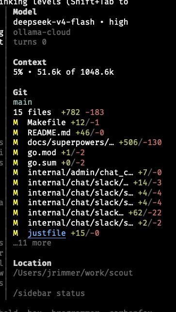

# @oldsuns/pi-sidebar

Floating right sidebar for the [pi coding harness](https://pi.dev) with model, context, git, and session metadata.

This is an **unofficial fork** of [@esso0428/pi-sidebar](https://github.com/esso0428/pi-sidebar), which is itself an unofficial fork of [jrimmer/pi-sidebar](https://github.com/jrimmer/pi-sidebar). Published under the `@oldsuns` npm scope. Changes inherited from @esso0428 over the original:

- **Cursor restoration on session shutdown** — ensures the terminal hardware cursor is shown (`\x1b[?25h`) when Pi exits, preventing the disappearing-cursor issue when the sidebar overlay is active.

`@oldsuns/pi-sidebar` renders a non-capturing right sidebar overlay, defaults to a vertically centered floating mode on the right side, and auto-hides while the LLM is working so it does not obscure review of in-progress model output. An optional full-height mode is available for a more fixed-window look.



> This fork replaces Pi's overlay API with a **terminal-column shim** that reserves space on the right side. Pi renders content in the reduced width and the sidebar is painted separately via ANSI escape codes, so there is no text overlap.

## Features

- **Floating sidebar by default** — right-anchored, non-capturing overlay positioned near the visual middle of the screen.
- **Optional full-height mode** — `/sidebar full` or `PI_SIDEBAR_FULL_HEIGHT=1` renders a fixed right window with a small gutter.
- **Cursor restoration on Pi exit** — hardware cursor is always restored; no more invisible cursor after leaving Pi.
- **Auto-hide while the LLM is working** — hides on turn start and reappears when the turn ends. Disable with `PI_SIDEBAR_AUTOHIDE_WORKING=0`.
- **Compact model section** — shows model + reasoning level on one line, provider underneath.
- **Compact context usage** — shows percentage first, then used/available context, e.g. `13% • 1.5k of 200.0k`.
- **Git branch and diff summary** — shows current branch, changed file count, and total `+/-` stats.
- **Per-file git deltas** — changed-file rows preserve room for deltas and color additions/deletions separately.
- **Truncated git list** — changed-file rows are capped so the centered sidebar does not grow too tall; overflow renders as `…N more`.
- **Configurable git detail** — toggle longer/reduced changed-file lists with `/sidebar-git-detail`.
- **No footer replacement** — leaves pi's native footer alone.
- **Responsive visibility** — auto-hides below a configurable terminal width.

Example layout:

```text
Model
gpt-5.5 • medium
openai-codex
turns 4
last tool use bash

Context
5% • 49.2k of 1048.6k

Git
main
3 files  +507 -134
M  docs/superpowers/… +506/-130
M  go.mod +1/-2
M  go.sum +0/-2

Location
/path/to/project

/sidebar status
```

## Install

### Install globally from npm

```bash
pi install npm:@oldsuns/pi-sidebar
```

### Install from source

```bash
git clone https://github.com/OldSuns/pi-sidebar
cd pi-sidebar
pi install ./
```

### Test for one run without installing

```bash
pi -e npm:@oldsuns/pi-sidebar
```

Reload an already-running pi after installation:

```text
/reload
```

Verify installation inside pi:

```text
/sidebar status
```

Manage the installed package:

```bash
pi list
pi update --extensions
pi remove npm:@oldsuns/pi-sidebar
```

Use project-local install only when you want `.pi/settings.json` in the current project to carry the dependency:

```bash
pi install -l npm:@oldsuns/pi-sidebar
```

## Commands

- `/sidebar` — toggle sidebar visibility
- `/sidebar on` — show sidebar
- `/sidebar off` — hide sidebar
- `/sidebar status` — show enabled/layout/autohide/git-detail state
- `/sidebar full` — use full-height fixed-window sidebar mode
- `/sidebar floating` — use the default floating overlay window
- `/sidebar-refresh` — refresh git/status data
- `/sidebar-git-detail` — toggle longer changed-file list

Shortcut:

- `ctrl+shift+s` — toggle sidebar

## Custom Data Panels (`sidebar-ui.json`)

The sidebar can display custom data from any pi extension that writes session entries via `ctx.sessionManager.appendEntry()`. Configure via `sidebar-ui.json`:

- **Global:** `~/.pi/agent/sidebar-ui.json`
- **Local:** `.pi/sidebar-ui.json` (overrides global)

### Built-in Skill

This package bundles the `pi-sidebar-ui-helper` skill, which walks the LLM through discovering available data and generating the correct config. Ask your LLM to help configure sidebar panels, or invoke it manually:

```
/skill:pi-sidebar-ui-helper
```

Example — show goal status in the sidebar:

```json
{
  "panels": {
    "goal": {
      "label": "Goal",
      "entryType": "goal-state",
      "variables": {
        "goal.text": "Goal",
        "goal.status": "Status",
        "goal.tokensUsed": "Tokens Used"
      }
    }
  }
}
```

## Environment Configuration

Set environment variables before starting pi:

| Variable | Default | Description |
| --- | ---: | --- |
| `PI_SIDEBAR_ENABLED` | `1` | Start enabled. Use `0` to start hidden. |
| `PI_SIDEBAR_WIDTH` | `34` | Sidebar content columns. |
| `PI_SIDEBAR_FULL_HEIGHT` | `0` | Use full-height fixed-window mode instead of floating mode. |
| `PI_SIDEBAR_BUFFER` | `1` | Blank gutter columns before the sidebar border in full-height mode. |
| `PI_SIDEBAR_FILL_ROWS` | `200` | Rows emitted to visually fill tall terminals in full-height mode. |
| `PI_SIDEBAR_MIN_TERM_WIDTH` | `110` | Auto-hide below this terminal width. |
| `PI_SIDEBAR_OFFSET_Y` | `-6` | Floating-mode vertical offset. Negative moves up; `0` uses the TUI's exact `right-center` anchor. |
| `PI_SIDEBAR_AUTOHIDE_WORKING` | `1` | Hide while the LLM is working. |
| `PI_SIDEBAR_REFRESH_MS` | `5000` | Git polling interval. |
| `PI_SIDEBAR_GIT_LINES` | `12` | Max changed-file rows rendered in detailed mode; overflow shows `…N more`. |
| `PI_SIDEBAR_MAX_FILES` | `12` | Legacy alias used only when `PI_SIDEBAR_GIT_LINES` is unset. |
| `PI_SIDEBAR_GIT_DETAIL` | `1` | Start with detailed changed-file list. Reduced mode shows up to 5 rows. |

Example:

```bash
PI_SIDEBAR_WIDTH=40 PI_SIDEBAR_AUTOHIDE_WORKING=0 pi
```

## Git data

The sidebar uses pi's `pi.exec` helper to run static `git` commands in the current working directory:

- `git rev-parse --is-inside-work-tree`
- `git branch --show-current`
- `git diff --shortstat`
- `git status --porcelain=v1`
- `git diff --numstat HEAD --`

No shell strings are assembled from user input. The sidebar displays file paths and diff counts, not file contents.

## Differences from upstream

### Cursor restoration on session shutdown

When Pi exits the terminal hardware cursor was left hidden (Pi TUI hides it by default). This fork adds `\x1b[?25h` (show cursor) in both `dispose()` and `session_shutdown`.

### No overlay overlap

The original `pi-sidebar` used Pi's overlay API, which draws on top of terminal content and covers text. `@oldsuns/pi-sidebar` uses a different approach inspired by [`pi-sidebar-tui`](https://github.com/bi0h4z4rd88/pi-sidebar-tui):

1. **Shrinks `terminal.columns`** — makes Pi think the terminal is ~35 columns narrower, so all content (transcript, input, footer) reflows to the left.
2. **Hooks `tui.doRender`** — after every Pi render cycle, paints the sidebar in the reserved right-side columns via direct ANSI escape codes.
3. **Synchronized output** — uses DECSM/DECRC + synchronized update (`\x1b[?2026h/l`) for tear-free rendering.

Because Pi never draws in the reserved columns, there is no overlap.

## Notes

The terminal-column shim approach (`Object.defineProperty(terminal, "columns", ...)`) is a workaround that directly modifies Pi's internal terminal object. While functionally effective, it hooks into Pi's internal `doRender` method. A proper fix would be native Pi TUI window-region support, as described in [Future native Pi TUI window regions](docs/architecture/native-tui-window-future.md).

## Docs

- [Design spec](docs/specs/2026-05-30-pi-sidebar-plugin-design.md)
- [Security/performance architecture review](docs/architecture/security-performance.md)
- [Future native Pi TUI window regions](docs/architecture/native-tui-window-future.md)

## Development

```bash
npm install --ignore-scripts
npm run verify
```

`npm run verify` runs TypeScript checks, unit tests, and `npm pack --dry-run` to confirm package contents.

### Adding a sidebar section

Sections are intentionally lightweight and local to this package. There is no nested Pi-package plugin system.

To add a section:

1. Add a self-contained renderer in `extensions/sidebar/sections/<name>.ts`.
2. Accept a `SidebarSectionContext` from `extensions/sidebar/types.ts`.
3. Register the section in the compositor's `buildSidebarContent` method.
4. Add or update tests in `tests/sidebar.test.ts`.

Existing examples: `model.ts`, `context.ts`, `git.ts`, `location.ts`, and `hint.ts`.

## License

BSD-3-Clause — same as the upstream.
